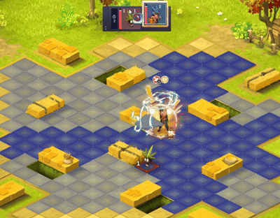
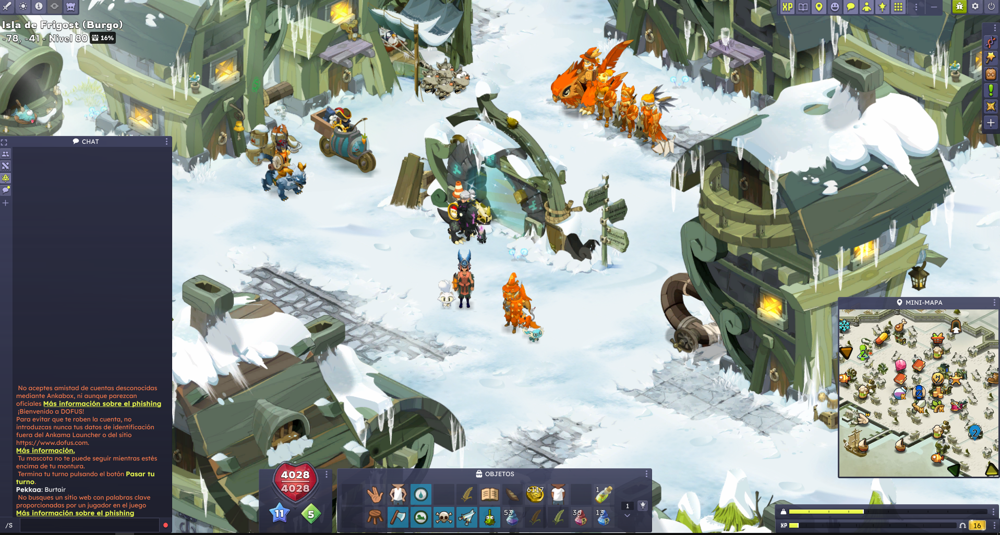
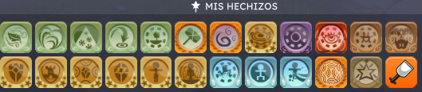
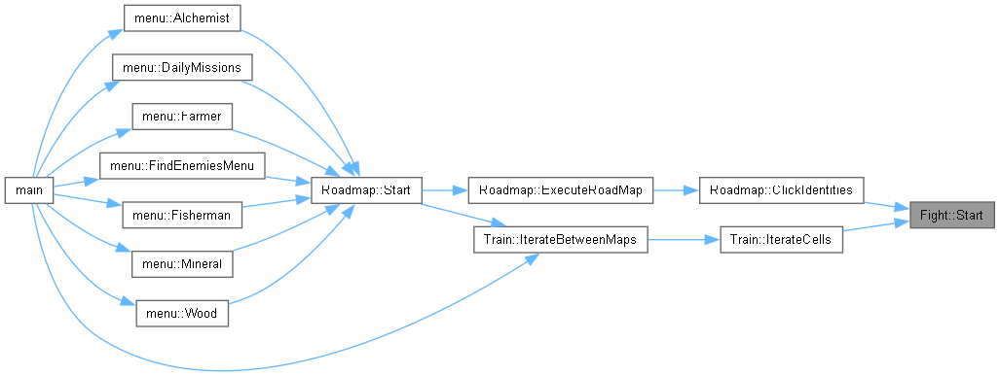
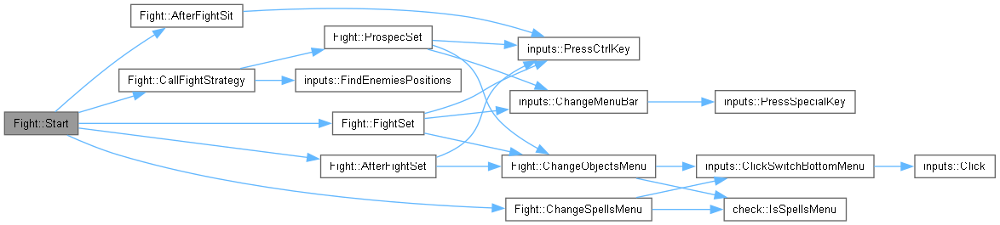
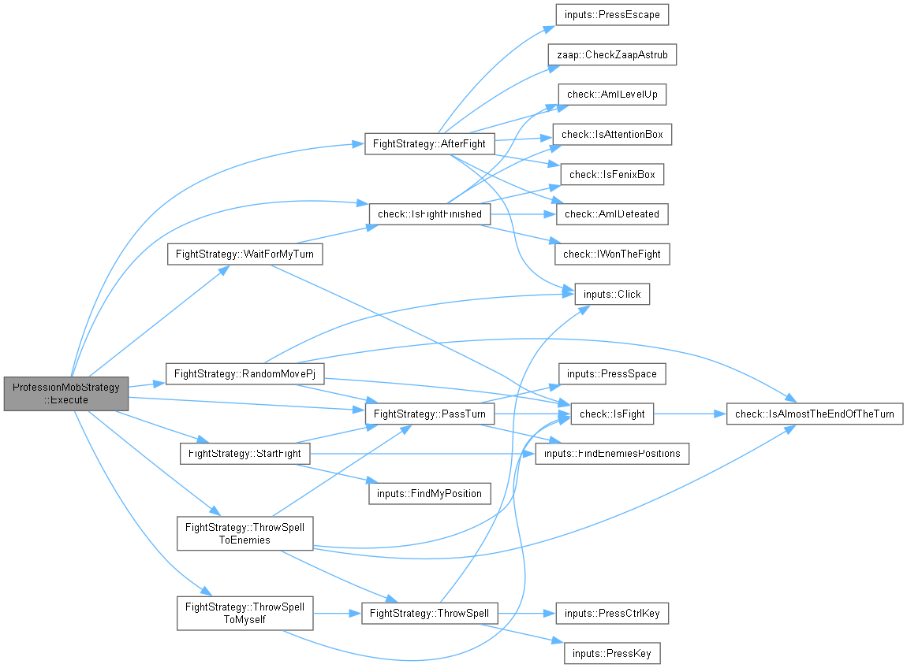

# Dofus3Click

A simple mechanical bot for Dofus 3

This bot iterate through a Roadmap to recolect resources automatically while you are AFK.

It follows a .csv telemetry with the points where the resources are located. <br>
(You need it to introduce it manually, but you can record a telemetry with this program 1, 2)


<br>
<br>

When it encounters a resource protector, figths it and kills it!




<br>
<br>

Log:


<br>
<br>

This bot also works for training. It iterates trough four maps finding the enemies on it and fighting them.

If your PJ dies, starts the roadmap again.

If your PJ dies and becomes a ghost, it goes to the closer fenix statue to resucitate and restart the roadmap.


<br>

## 🧩 In-Game Interface (UI) Layout

Ui should look like this:




| Element | Position/Layout |
| :--- | :--- |
| **Chat Menu** | On the left, further out than the map change zone. |
| **Map** | On the Right. Slightly moved up. |
| **XP Bar** | Bottom-left and smaller. |
| **Pods Bar** | Bottom-left, just on top of the XP bar. |
| **Item/Object Menu** | **2-Row** configuration. |

Keep the sets shortcuts on those positions.

 - Set Pods        (3)
 - Set Fight       (Ctrl + 4)
 - Set Prospection (4)

More important, keep available recall potions on (Ctrl + 8)

Sit emote on (Ctrl + 2)


---

Spells menu should like something like this:




Upper row for attacks, First bottom row for defending.


## 🎮 Game Setup and Preparation

- Windows - Night light 60%

- Taskbar must be of 30 width.

### 🖥️ Screen and Launcher Configuration (Ankama Launcher)

| Element | Setting | Details |
| :--- | :--- | :--- |
| **Resolution** | `1920x1080` | Base screen resolution. |
| **Language** | `Español` | Configured in the Ankama Launcher. |
| **Performance** | `Low Configuration` | Recommended for optimized performance. |

### ⚙️ In-Game Main Menu Options (Apariencia)

| Option | Setting | Status |
| :--- | :--- | :--- |
| **Display Mode** | `Windowed (Ventana)` | Essential for automation. |
| **Game Quality** | `Low (Baja)` | Reduced graphic quality. |
| **Aura** | `Disable All (Desactivar)` | Removes visual effects. |
| **Graphical Appearance of Maps** | `Disable All (Desactivar)` | Removes cosmetic map details. |

***

### 🔒 Interface Locking and Combat Settings

| Menu | Option | Status |
| :--- | :--- | :--- |
| **Options > Interface** | Lock Interface Modules | ✅ Enabled |
| **Options > Combat** | Hide Summons | ✅ Enabled |


## ⌨️ Keyboard Shortcuts (Hotkeys)

These are the fundamental movement and interface hotkeys required for the game execution.

### Movement and Interaction

| Action | Hotkey |
| :--- | :--- |
| **Go North** | `Alt + W` |
| **Go South** | `Alt + S` |
| **Go West (Oste)** | `Alt + A` |
| **Go East (Este)** | `Alt + D` |
| **Transparency** | `X` |
| **Monsters and NPCs Bubble/Tooltip** | `Z` |
| **Interactive Elements** | `Y` |

### Combat and Chat

| Action | Hotkey |
| :--- | :--- |
| **Activate Chat Window** | `[Custom Key]` (Something other than `Space`) |
| **Melee Attack** | `Q` |
| **End Turn** | `Space` |

### More in game settings

- Victory menu small.

- Acept reto automatically when starting a fight.

- Reto aleatorio.

## Setup

Cmake with VSCode. Clang14

```bash
cmake -B build
```


## How to execute

After compile-building it

.exe located at: /build/bin/Dofus3Click.exe

Right Click -> Open as an administrator.

An external terminal would appear (Game support).


## Documentation

Generate documentation executing this command. (Make sure you have Doxygen installed).

```bash
doxygen Doxyfile
```


## How it is implemented

A quick look at how the code and the calls work:




Fight Class:




If you want to know the strategy the PJ uses to fight:
Is still quite brute force, pending to improve it.





## About

First version, on Dofus2: https://github.com/Garriden/Bots/tree/main/Dofus

Marc Garrido Casas. &copy; 2025. All rights reserved.
